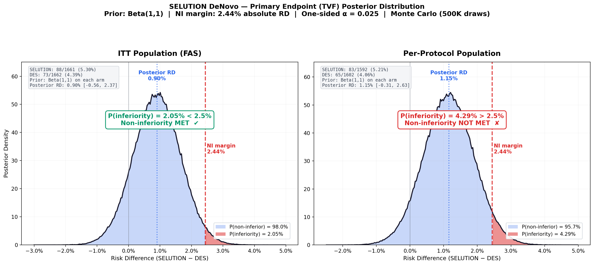
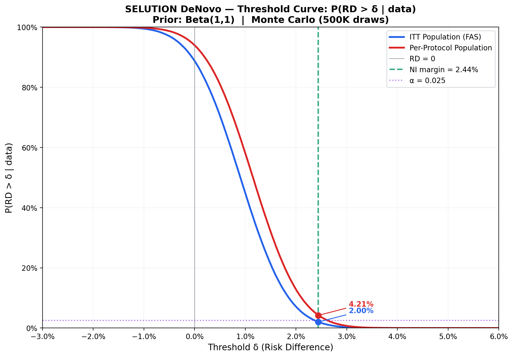

# SELUTION DeNovo — Independent Statistical Re-Analysis

Independent Bayesian and frequentist re-analysis of the SELUTION DeNovo trial (NCT04859985): sirolimus drug-eluting balloon vs systematic DES in de novo coronary lesions.

## Scripts

| Script | Description |
|---|---|
| `run_analysis.py` | Runner — calls all modules for ITT and PP |
| `bayesian.py` | Bayesian re-analysis (normal-normal conjugate, OR scale) |
| `fragility.py` | Classical fragility index (Fisher's exact) |
| `benefit_risk.py` | Benefit-risk assessment (FDA BRF framework) |
| `fi_noninferiority.py` | Non-inferiority fragility index (RD scale, α = 0.025) |
| `density_plot.py` | Posterior density plot (Beta(1,1), Monte Carlo 500K draws) |
| `threshold_curve.py` | Threshold curve: P(RD > δ) for ITT and PP |

## Key Results

| | ITT | Per-Protocol |
|---|---|---|
| TVF | 5.3% vs 4.4% | 5.2% vs 4.1% |
| P(inferiority) | 2.05% | 4.29% |
| NI (α = 0.025) | **MET** | **NOT MET** |
| Fragility Index | **2** | — |

## Figures

### Posterior Density (TVF)

### Threshold Curve

## Methods

- **NI margin:** 2.44% absolute risk difference
- **Alpha:** One-sided 0.025
- **Bayesian prior:** Beta(1,1) on each arm
- **Monte Carlo:** 500,000 draws
- **Frameworks:** Zampieri et al. (2021), FDA BRF, Walsh et al. (2014)

## Data Sources

TCT 2025 and CRT 2026 conference presentations. Trial protocol: Spaulding C et al., *Am Heart J* 2023;258:77–84.
